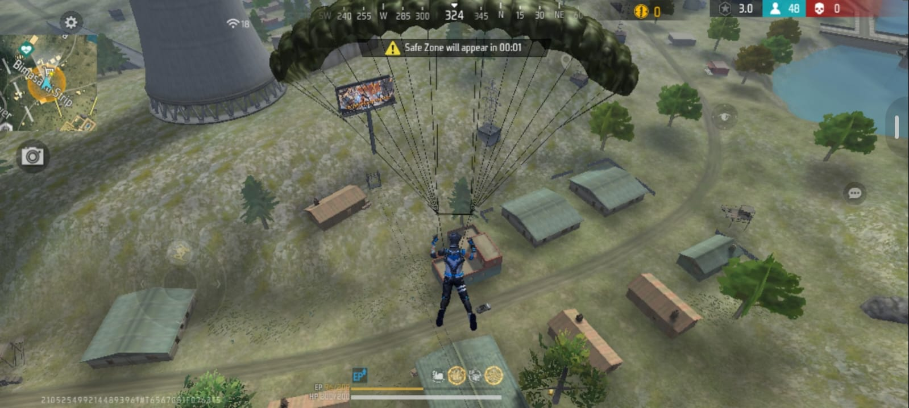
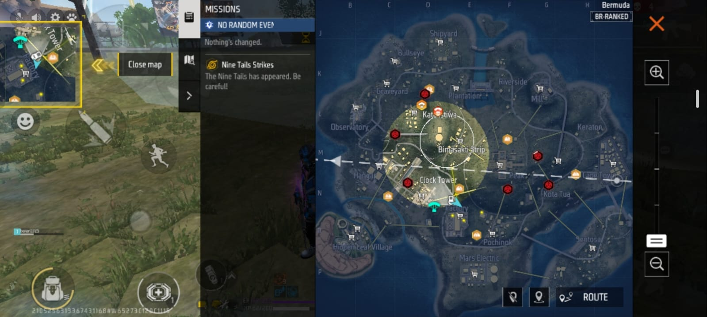
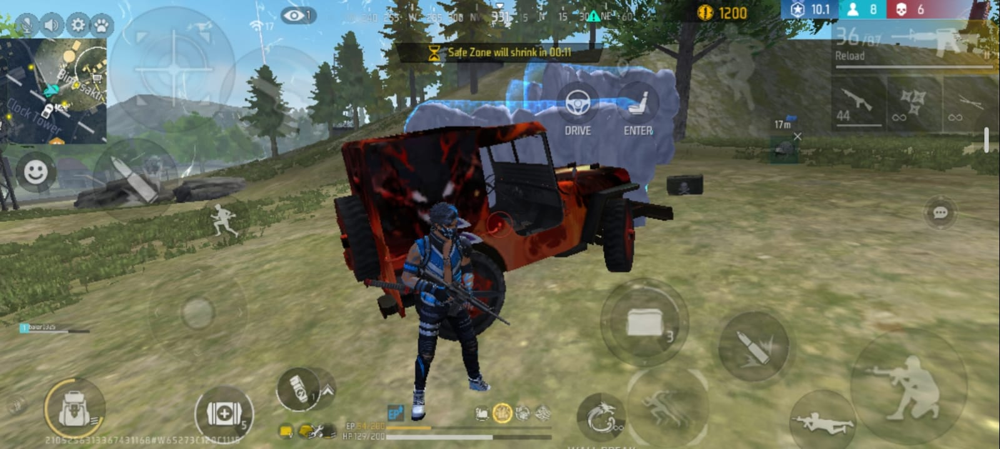
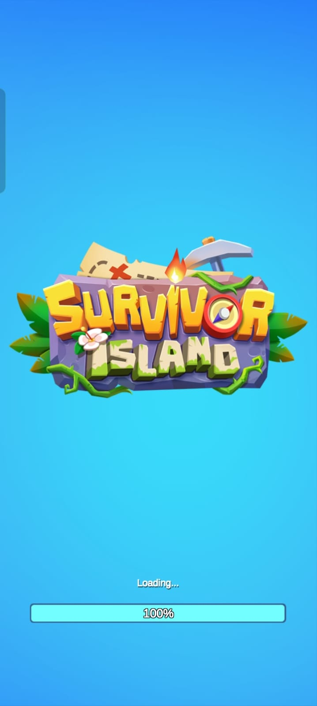
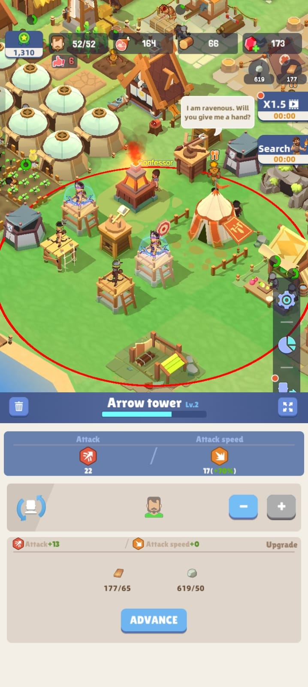
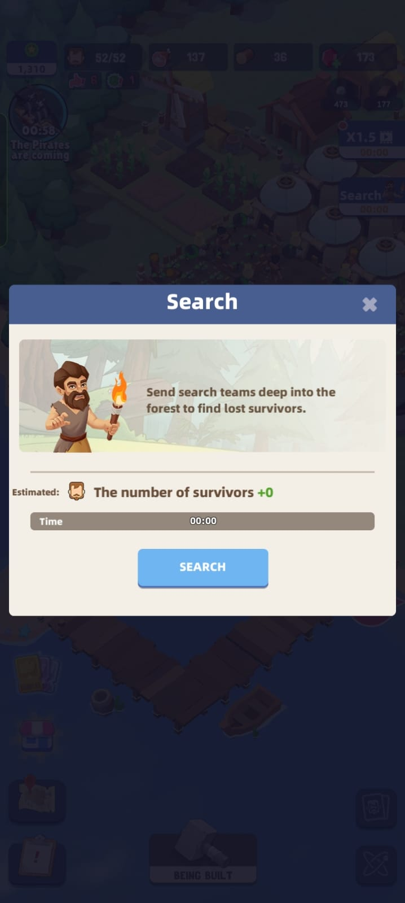
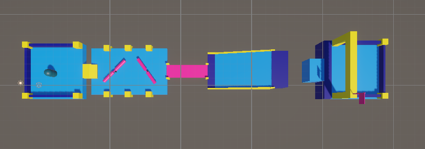
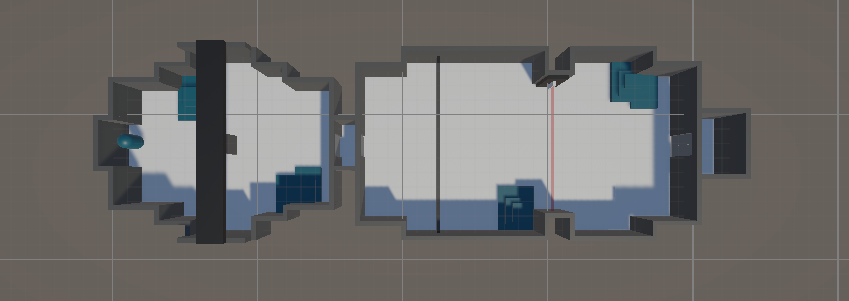
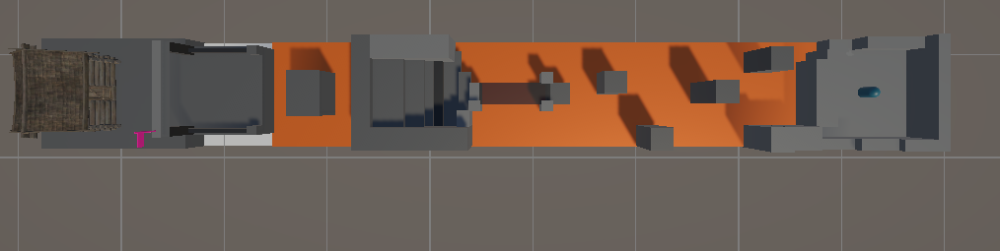
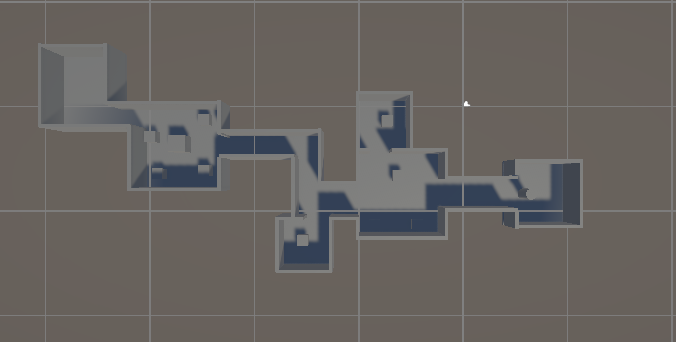

# CS464 Assignment 01 · [M.Abubakar] · [BSCS25109]

## Game 1 · Free Fire

- **Store link:** https://play.google.com/store/apps/details?id=com.dts.freefiremax
- **Genre:** Battle Royale / Third-Person Shooter
- **I played:** 30 minutes for this assignment. I have also played Free Fire before and completed several Battle Royale matches.

  
  
  
  
  
  
  

**[M1, M2]** · Choosing a landing area and collecting weapons, ammo, armor and healing items.  
**[M3, M4, M5]** · Staying inside the safe zone while managing ammo, health and healing.  
**[M6, M7]** · Using Gloo Walls for cover and fighting other players to survive.

| # | Mechanic | Dynamic | Aesthetic | Bartle type |
|---|---|---|---|---|
| M1 | Players choose when to leave the aircraft and where to land. | Hot drops give faster fights, while quieter areas are safer for looting. | **Discovery:** learning good landing spots. | **Explorer:** learns the map and useful locations. |
| M2 | Players collect weapons, ammo, armor and healing items from the map. | Players search nearby buildings and decide what gear to keep. | **Discovery:** finding useful loot. | **Explorer:** searches the game world for resources. |
| M3 | The safe zone gets smaller and damages players outside it. | Players must keep moving and change position as the zone closes. | **Challenge:** survive while managing movement and fights. | **Achiever:** works around the game’s survival rules. |
| M4 | Guns have limited ammo and magazine size. | Players reload behind cover and manage ammo during fights. | **Challenge:** timing shots and reloads matters. | **Achiever:** improves at the combat system. |
| M5 | Damage lowers health, while healing and armor help the player survive. | Players decide when to fight, retreat or heal. | **Challenge:** survival depends on good timing. | **Achiever:** manages health and survival systems. |
| M6 | Gloo Walls create temporary cover. | Players use them for healing, reloading or changing position. | **Expression:** players can use the same tool in different ways. | **Achiever:** uses the tool to gain a better position. |
| M7 | Players can damage and eliminate other players. | Players fight, ambush and avoid bad fights until one player or team remains. | **Challenge:** every fight can end the match. | **Killer:** directly competes with and eliminates players. |

**Aesthetic profile:**  
Free Fire is mainly about **Challenge**, with some **Discovery** and **Expression**. The challenge comes from gunfights, the safe zone and resource management. Discovery comes from learning the map, while expression appears in choices such as how Gloo Walls are used.

**Player types:**  
- **Primary: Killer** — PvP combat and eliminating opponents are a major part of the match.
- **Secondary: Achiever** — players also manage weapons, health, positioning and the safe zone.

---

## Game 2 · Survivor Island

- **Store link:** [Paste the Google Play link for the exact Survivor Island game you played]
- **Genre:** Survival / Simulation / Idle
- **I played:** [Write your actual play time and how far you got]

  
  
  
  
  
  
  

**[M1, M2, M3]** · Survivors work, gather resources and develop the settlement.  
**[M4, M6]** · Survival systems and defenses are maintained.  
**[M5, M7]** · Exploration opens new opportunities, while idle progress continues over time.

| # | Mechanic | Dynamic | Aesthetic | Bartle type |
|---|---|---|---|---|
| M1 | Survivors can be assigned to different jobs. | Players move workers to the jobs that need more resources. | **Challenge:** balancing a limited workforce. | **Achiever:** improves settlement production. |
| M2 | Food and other resources are used over time. | Players save important resources and delay less useful upgrades. | **Challenge:** managing shortages. | **Achiever:** manages the resource system. |
| M3 | Buildings need resources and improve the settlement. | Players decide what to build or upgrade first. | **Expression:** the settlement can be developed in different ways. | **Achiever:** grows and upgrades the settlement. |
| M4 | Important survival systems must be kept running. | Players keep enough resources for survival instead of spending everything on growth. | **Challenge:** poor resource choices can slow progress. | **Achiever:** maintains the settlement systems. |
| M5 | New areas or survivors can be found through exploration. | Players explore to unlock more resources and opportunities. | **Discovery:** new parts of the island are revealed. | **Explorer:** looks for new places and content. |
| M6 | Defenses or combat units protect the settlement. | Players balance defense spending with economic growth. | **Challenge:** prepare for threats without stopping progress. | **Achiever:** builds stronger defenses. |
| M7 | Some progress continues while the player is away. | Players return later, collect resources and start new tasks. | **Submission:** works well for short repeated sessions. | **Achiever:** steady progress is rewarded over time. |

**Aesthetic profile:**  
Survivor Island mainly uses **Challenge**, **Discovery** and **Submission**. Most of the challenge comes from workers, food, resources and defenses. Exploration adds discovery, while the idle system supports short sessions and returning later.

**Player types:**  
- **Primary: Achiever** — most of the game is about building, upgrading and improving the settlement.
- **Secondary: Explorer** — exploration is used to find new areas, survivors and resources.

---

## Part C · Level blockouts

| Level | Screenshot | Its idea | Wayfinding tool |
|---|---|---|---|
| Level01 |  | **Fall Guys style obstacle course to reach the finish. | Leading lines the bridge, rails, ramp edges, and course layout visually direct the player forward toward the goal. |
| Level02 |  | **Smash Hit style level where the player moves forward through enclosed rooms and obstacles. | Framing   walls, doorways, and narrow openings frame the route and show the player where to move next. |
| Level03 |  | **Minecraft style parkour where the player jumps across obstacles to reach the house. | Landmarks  the house works as a clear visual destination, helping the player know where to go.|
| Level04 |  | **Escape room style navigation puzzle where the player moves through connected rooms and side paths to reach the exit.** | **Breadcrumbs   colored lights/arrows along the route guide the player from room to room toward the final exit.** |
